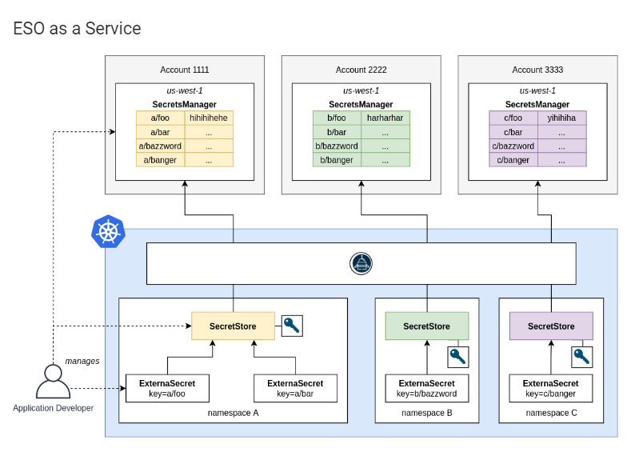
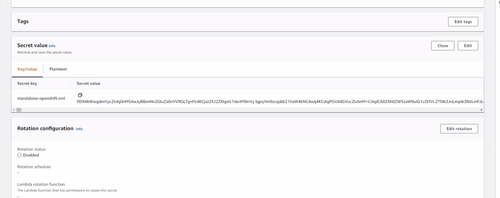
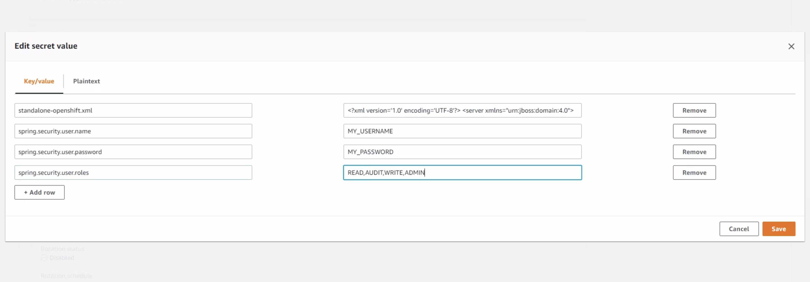
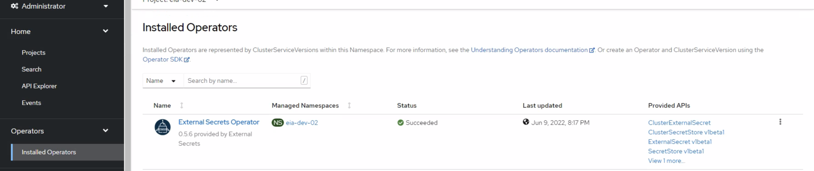
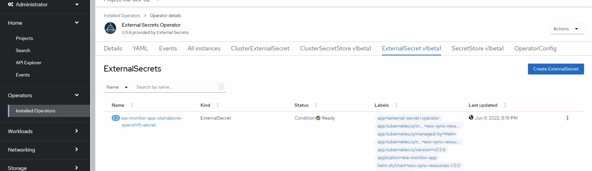
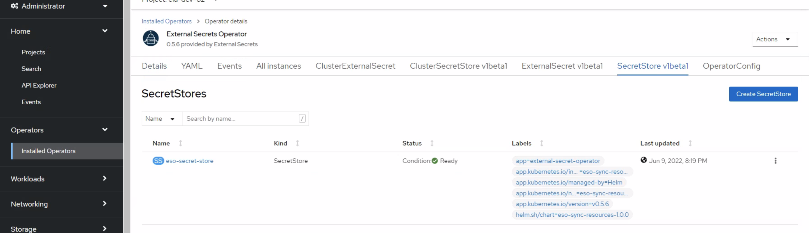
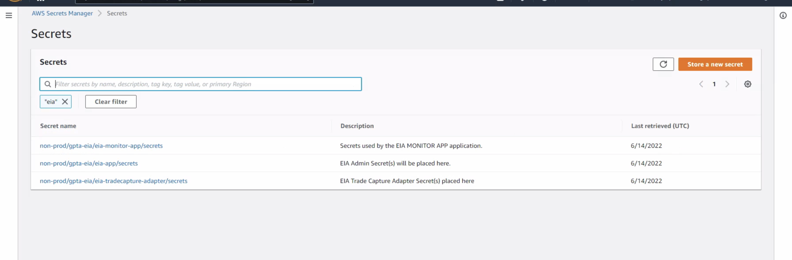

[[_TOC_]]
# EIA External Secrets Operator(ESO)

## Overview

This repo is a collection of Helm charts which when deployed in locksteps one after the other enable secrets stored in AWS secret manager to be fetched, [transformed], and stored in secret objects in a kubernetes cluster.

> The External Secrets Operator extends Kubernetes with Custom Resources, which define where secrets live and how to synchronize them. The controller fetches secrets from an external API and creates Kubernetes secrets. If the secret from the external API changes, the controller will reconcile the state in the cluster and update the secrets accordingly. -- ESO Definition.

## Design Considerations

External Secrets Operator provides different modes of operation to fulfill ogranizational needs.

Being in a multi-tenant setting, in addition to app teams wanting to manage their own deployments, we've opted for the **ESO as a Service** route.

This entails that every namespace is self-contained. Application developers manage SecretStore, ExternalSecret and secret infrastructure on their own. Cluster Administrators just provide the External Secrets Operator as a service.




## Deployment

> The `eso-sync-resources` follows the design approach of having one AWS Secret Manage bucket per secret, per application.

Following charts will be deployed:

- **eso-deplooyment-resources**: Deploys the ESO operator CRDs (OperatorGroup, Subscription, OperatorConfig); using the NCO config repos, add `amq_operator: true` under the namesapce you want the operator deployed.
- **eso-sync-resources**: Deploys the the objects needed to integrate with AWS and having application secrets created. SecretStore, ExternalSecret(one per secret, per aws secret bucket), Secret objects will be created by the chart. Specify the applicaton/secret list in the values.yaml file.

### Prerequisites

Prior to deploying these modules; following prereqs must be met:

- Access to an active AWS account
- Secret Manager bucket created, required groups and inbound/outbound policies applied
- IAM user with rights to at least read secret manager bucket
- AWS_ACCESS_KEY, AWS_SECRET_ACCESS_KEY details
- Service Account with edit access to target namespace

### Installattion Steps

At a higher level, the installation adhere to the following steps:

1. Create the AWS **Secrets Manager** Bucket and place sensive data into the bucket following the `{"key": "value"}` pair format.

  | WARNING: Ensure secrets values are encoded to `Base64` to keep formatting in case there are multiline strings; for example a secret with content a text file. |
  | --- |

  **Example:**

  Place your secret (multiline string or not) in a text file and execute below command.

  ```
  $ cat clearTextFile.txt | base64 > encodedFile.txt
  ```

  

  

    As you see above; this is how we will place all our secret `{"key": "value"}` pairs into a single **Secrets Manager** bucket for ease of management; the rule is to have one secrets bucket per application.

2. Create an IAM Role and grant it permission to read the newly created AWS Secret Manager bucket.

3. Install the  charts/eso-deployment-resources chart
2. Verify operator chart was installed successfully

    

3. Install the charts/eso-sync-resources chart

    After successful installation, the following pods should be in a **Running** state.
    ```
    $ oc get po | grep eso
    eso-external-secrets-c649c494c-wf4md                           1/1     Running     0          4d14h
    eso-external-secrets-cert-controller-5ffc868575-lvpqw          1/1     Running     0          4d14h
    eso-external-secrets-webhook-774f49769c-ndh94                  1/1     Running     0          4d14h
    ```

4. Verify secret synchronization chart is installed successfully

    SecretStore and ExternalSecret CRDs should be in the **Ready** state.

    
    

For more in depth installation details, refer to the [Jenkinsfile](./Jenkinsfile) in this repo.

### Adding more application secrets

The `eso-sync-resources` chart design allows integration with multiple applications/aws secrets bucket; the only caveat is we have to ensure the IAM User has permissions to read all buckets we want to sync with.


Here's an exmaple of adding a second application/aws secret bucket sync.

1. Open the `eso-sync-resources/values.yaml` file 
2. Add the details of the new app sync under the **externalsecret.apps:** key

    **Before the change**

    ```
    externalSecret:
      apps:
      - name: eia-payment-service
        enabled: true
        project: eihaving
        refreshInterval: 1h
        # Possible Values: "Opaque", "kubernetes.io/dockerconfigjson", "kubernetes.io/tls", "kubernetes.io/ssh-auth"
        secretType: Opaque
        localSecretName: eia-payment-service-standalone-openshift-secret
        remoteSecretBucket: "non-prod/eihaving/eia-payment-service/secrets"
        keySets:
        - remoteKey: "standalone-openshift.xml"
          # Replace dots(.) by underscores; use snake case(substr1_substr2_substr3)
          templateKey: "standalone_openshift_xml"
    ```

     **After the change**

    
    
    ```
    externalSecret:
      apps:
      - name: eia-payment-service
        enabled: true
        project: eihaving
        refreshInterval: 1h
        # Possible Values: "Opaque", "kubernetes.io/dockerconfigjson", "kubernetes.io/tls", "kubernetes.io/ssh-auth"
        secretType: Opaque
        localSecretName: eia-payment-service-standalone-openshift-secret
        remoteSecretBucket: "non-prod/eihaving/eia-payment-service/secrets"
        keySets:
        - remoteKey: "standalone-openshift.xml"
          # Replace dots(.) by underscores; use snake case(substr1_substr2_substr3)
          templateKey: "standalone_openshift_xml"
      - name: eia-stock-management-service
        enabled: true
        project: eihaving
        refreshInterval: 1h
        # Possible Values: "Opaque", "kubernetes.io/dockerconfigjson", "kubernetes.io/tls", "kubernetes.io/ssh-auth"
        secretType: Opaque
        localSecretName: eia-stock-management-service-tcadapter-secret
        remoteSecretBucket: "non-prod/eihaving/eia-stock-management-service/secrets"
        keySets:
        - remoteKey: "tcadapter.properties"
          # Replace dots(.) by underscores; use snake case(substr1_substr2_substr3)
          templateKey: "tcadapter_peroperties"
      - name: eia-shipping-service
        enabled: true
        project: eihaving
        refreshInterval: 1h
        # Possible Values: "Opaque", "kubernetes.io/dockerconfigjson", "kubernetes.io/tls", "kubernetes.io/ssh-auth"
        secretType: Opaque
        localSecretName: eia-shipping-service-standalone-openshift-secret
        remoteSecretBucket: "non-prod/eihaving/eia-shipping-service/secrets"
        keySets:
        - remoteKey: "standalone-openshift.xml"
          # Replace [.-] by underscores; use snake case(substr1_substr2_substr3)
          templateKey: "standalone_openshift_xml"
    ```
    After you commit, push the changes; and redeploy the helm chart, we should see three secrets created with names matching definions in the helm chart.

    **Results should look like this**

    ```
    $ oc get secret | grep -E 'eia.*-secret'
    eia-shipping-service-standalone-openshift-secret                            Opaque                                1      21m
    eia-payment-service-standalone-openshift-secret                    Opaque                                1      3m14s
    eia-stock-management-service-tcadapter-secret                      Opaque                                1      3m15s

    $ oc delete secret eia-shipping-service-standalone-openshift-secret
    secret "eia-shipping-service-standalone-openshift-secret" deleted
    
    $ oc get secret | grep -E 'eia.*-secret'
    eia-shipping-service-standalone-openshift-secret                            Opaque                                1      4s
    eia-payment-service-standalone-openshift-secret                    Opaque                                1      3m53s
    eia-stock-management-service-tcadapter-secret                      Opaque                                1      3m54s
    ```

### Issues that may arise during Installation

#### 1. Occasionally, during installation below error may show up:


```
  UPGRADE FAILED: failed to create resource: Internal error occurred: failed calling webhook "validate.externalsecret.external-secrets.io"
```

To resolve above error, find the `ValidatingWebhookConfiguration` instance created by the ESO operator and remove it(I emphasize the instance created by the ESO; not all of them). You need elevated privileges to  delete the object.


#### 2. Occasionally the operator gets stuck in **Pending** status; when this happens delete every k8s native objects and CRDs that came with the Operator and retry the installation.

  Objects:
  - Subscription
  - InstallPlan or IP
  - ClusterServiceVersion or CSV
  - SecretStore
  - ClusterSecretStore
  - ExternalSecret
  - ClusterExternalSecret
  - Secret
  - ServiceAccount
  - Deployment
  - Pod

### Clean Up

To clean up the resources deployed, execute the `sh ./uninstall-eso-resources.sh` script.

